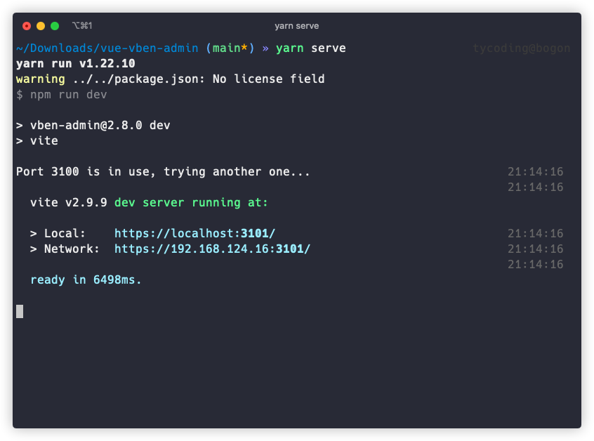
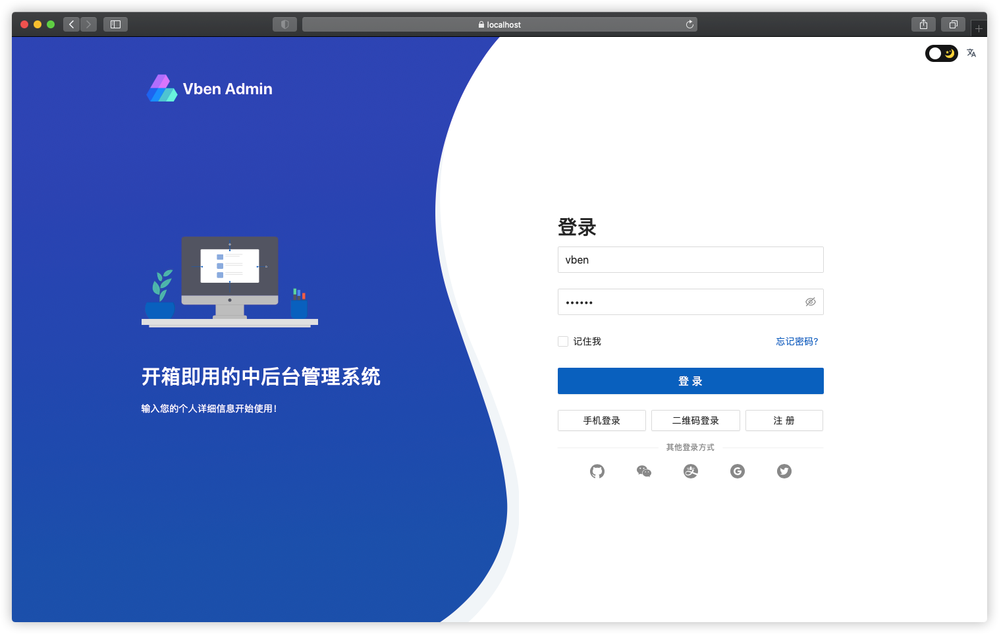

# Vben-admin

在之前的文章中，我们介绍过了，本项目前端是基于`vben-admin`开发的，所以在开始之前我们必须要熟悉`vben-admin`这个项目。

## Vben是什么？

`vben-admin`是一个开源的中后台管理系统，基于前端最新的技术栈：vue3、typescript、vite、ant-design-vue3.x开发。

- 开源地址：[https://github.com/vbenjs/vue-vben-admin](https://github.com/vbenjs/vue-vben-admin)
- 预览地址：[https://vvbin.cn/next/](https://vvbin.cn/next/#/)
- 文档地址：[https://vvbin.cn/doc-next/](https://vvbin.cn/doc-next/)

> 为什么要用vben？

如果在Vue2阶段，相信你应该非常熟悉`vue-element-admin`这个前端开源项目，在很多个人、公司的前端项目中都能看到此项目的身影。

而随着Vue3的到来，elementUI并没有及时更新上来，而且相对ant-design-vue，后者的UI组件要更加丰富，对于我们后端开发者来说，使用起来也能更大程度减少手写CSS。

## 运行vben-admin

1. Get the project code
```shell
git clone https://github.com/anncwb/vue-vben-admin.git
```

2. Installation dependencies
```shell
cd vue-vben-admin
pnpm install
```

3. run
```shell
pnpm serve
```

4. build
```shell
pnpm build
```



浏览器访问 `localhost:3101`




## 如何二开

> 项目难点

1. **封装：**
如果你看到vben的源码就应该知道，作者在该项目中在ant-design-vue的基础上封装了非常多的组件，例如常见的Table、Modal、Form等等组件都进行了封装。

2. **设计思路：**
虽然使用起来更方便了，但也提高了学习成本，如果你对前端Axios、Router、Store、Layout类似的项目设计和封装思路不熟悉的话，学习此项目可能难度比较大。

3. **语法：**
首先你要知道Vue3相对Vue2的区别都有什么，其次你要了解下TypeScript的语法结构。

> 如何二次开发？

虽然此项目封装了大量的自定义组件，且用了Vue3和TypeScript，但其实常用的功能无非就是CRUD，因此仅作为一个后端的使用者而非前端开发者来说，我们仅仅需要了解如下几个技术点即可：

1. Axios如何封装的，如何针对具体业务修改Axios封装逻辑
2. Router如何封装的，如何后端请求权限菜单，如何在前端定义路由菜单
3. CRUD组件如何封装的，其实就是对于Table、Form、Modal的组件的运用

在后面的文章中，笔者会依次介绍这些部分封装逻辑和如何进行修改。


# 联系

- 个人博客：[http://tycoding.cn](http://tycoding.cn)
- 微信公众号：程序员涂陌
- QQ交流群：866685601
